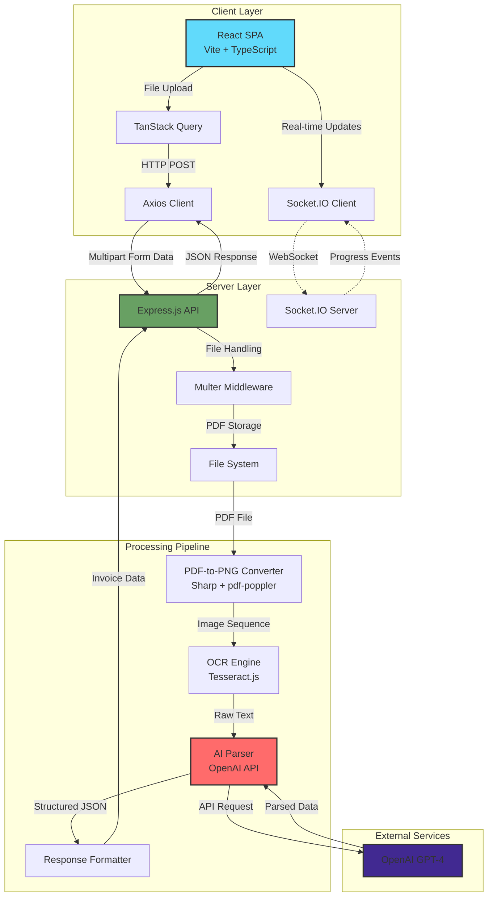

# AI-Powered OCR Invoice Parser

**Production-grade intelligent document processing system for automated invoice data extraction**

## Overview

A full-stack TypeScript application that transforms unstructured PDF invoices into structured, machine-readable data using a sophisticated OCR + AI pipeline. Built to solve real-world business process automation challenges by eliminating manual data entry and reducing invoice processing time from minutes to seconds.

The system processes multi-page PDFs through a three-stage pipeline: PDF-to-image conversion, optical character recognition, and AI-powered structured data extraction, delivering invoice metadata with high accuracy and reliability.

## System Architecture



## Tech Stack

### Frontend


- **React 19** with TypeScript for type-safe component architecture
- **Vite** for lightning-fast HMR and optimized production builds
- **TanStack Query (v5)** for declarative async state management and intelligent caching
- **Tailwind CSS 4** for utility-first styling with JIT compilation
- **Socket.IO Client** for real-time progress streaming
- **PDF.js** for client-side PDF preview capabilities
- **Playwright** for end-to-end testing and quality assurance

### Backend


- **Express.js 5** with TypeScript for robust API routing and middleware pipeline
- **Tesseract.js** for high-accuracy OCR text extraction
- **OpenAI API** for intelligent structured data parsing using GPT models
- **Sharp** for high-performance image processing and format conversion
- **pdf-lib + pdf-parse + pdf-poppler** for comprehensive PDF manipulation
- **Multer** for secure multipart/form-data file uploads
- **Socket.IO Server** for bidirectional event-driven communication
- **Morgan** for HTTP request logging and debugging

### DevOps & Tooling

- **Docker** support for containerized deployments
- **Husky** for pre-commit hooks ensuring code quality
- **Prettier** for consistent code formatting across the monorepo
- **ESLint** with TypeScript rules for static analysis
- **tsx** for TypeScript execution in development
- **Nodemon** for automatic server restarts during development

## Key Features

### Advanced Processing Pipeline

- **Multi-Stage PDF Processing**: Converts PDF pages to high-resolution PNGs using poppler for optimal OCR accuracy
- **Tesseract OCR Integration**: Extracts raw text from images with configurable language support (eng.traineddata included)
- **AI-Powered Data Extraction**: Uses OpenAI's GPT models with custom prompts to parse unstructured invoice text into structured JSON
- **Real-Time Progress Updates**: WebSocket-based progress streaming provides instant feedback during multi-page processing

### Production-Ready Architecture

- **Error Handling**: Centralized error middleware with proper HTTP status codes and logging
- **File Cleanup**: Automated temporary file management to prevent disk space issues
- **CORS Configuration**: Environment-aware CORS policies for secure cross-origin requests
- **Request Logging**: Morgan-based HTTP logging for debugging and monitoring

### Developer Experience

- **TypeScript Monorepo**: Full type safety across client and server with shared interfaces
- **Hot Module Replacement**: Vite's instant HMR for rapid frontend iteration
- **Custom React Hooks**: Abstracted business logic into reusable hooks (`useMutatePdfFile`, `useSockets`, `useHandleFileChange`)
- **Code Quality Automation**: Husky pre-commit hooks enforce formatting and linting standards

## Technical Decisions

### Why This Stack?

**React 19 + Vite**: Chosen for cutting-edge features like automatic batching, transitions API, and Vite's sub-second cold starts. The combination provides optimal DX and UX compared to Next.js (unnecessary for this SPA use case) or CRA (deprecated and slow).

**TanStack Query over Redux**: Eliminated boilerplate by leveraging TanStack Query's built-in caching, automatic refetching, and optimistic updates. No need for Redux when the app primarily fetches and displays server data.

**Tesseract.js + OpenAI Hybrid Approach**: Tesseract handles OCR (cheaper than Vision APIs per page), while OpenAI specializes in parsing unstructured text into structured data. This division of labor optimizes both cost and accuracy.

**Socket.IO for Progress Tracking**: REST APIs don't support server-to-client push. Socket.IO provides real-time feedback during long-running OCR jobs, significantly improving perceived performance.

**Monorepo Structure**: Keeps client and server in sync with shared TypeScript types. Simplified deployment while maintaining clear separation of concerns.

**TypeScript Everywhere**: Catch runtime errors at compile time, improve IDE autocomplete, and serve as living documentation for complex data structures (invoice schemas, API contracts).

## Getting Started

### Prerequisites

- **Node.js** 18+ (LTS recommended)
- **npm** 9+ or **pnpm** 8+
- **OpenAI API Key** (required for AI parsing)

### Installation

1. **Clone the repository**

```bash
git clone https://github.com/YosefHayim/ai-ocr-parser-web.git
cd ai-ocr-parser-web
```

2. **Install dependencies**

```bash
# Install client dependencies
cd client
npm install

# Install server dependencies
cd ../server
npm install
```

3. **Configure environment variables**

**Client** (`client/.env`):

```bash
VITE_API_URL=http://localhost:5000
```

**Server** (`server/.env`):

```bash
# Server Configuration
PORT=5000
NODE_ENV=development
LOCAL_URL=http://localhost:5173
DEPLOYED_URL=https://your-production-url.com

# AI Provider (at least one required)
ANTHROPIC_API_KEY=sk-ant-api03-xxxxx
OPENAI_API_KEY=sk-proj-xxxxx
GOOGLE_API_KEY=xxxxx
PERPLEXITY_API_KEY=pplx-xxxxx

# Optional AI Providers
MISTRAL_API_KEY=xxxxx
XAI_API_KEY=xxxxx
GROQ_API_KEY=xxxxx
OPENROUTER_API_KEY=xxxxx
AZURE_OPENAI_API_KEY=xxxxx
OLLAMA_API_KEY=xxxxx

# Optional Services
GITHUB_API_KEY=ghp_xxxxx  # For GitHub import/export features
```

### Running Locally

**Development Mode** (with hot reload):

```bash
# Terminal 1 - Start backend server
cd server
npm run dev

# Terminal 2 - Start frontend dev server
cd client
npm run dev
```

The application will be available at:

- **Frontend**: http://localhost:5173
- **Backend**: http://localhost:5000

**Production Mode**:

```bash
# Build client
cd client
npm run build
npm run preview

# Build and run server
cd server
npm run prod
```

### Docker Deployment (Optional)

```bash
# From server directory
docker build -t ai-ocr-parser-server .
docker run -p 5000:5000 --env-file .env ai-ocr-parser-server
```

## Environment Variables

### Required Server Variables

| Variable            | Description                  | Format                        |
| ------------------- | ---------------------------- | ----------------------------- |
| `PORT`              | Server port number           | `5000`                        |
| `NODE_ENV`          | Environment mode             | `development` \| `production` |
| `LOCAL_URL`         | Frontend URL (dev)           | `http://localhost:5173`       |
| `DEPLOYED_URL`      | Frontend URL (prod)          | `https://your-domain.com`     |
| `ANTHROPIC_API_KEY` | Claude API key (recommended) | `sk-ant-api03-...`            |
| `OPENAI_API_KEY`    | OpenAI API key               | `sk-proj-...`                 |

### Optional AI Provider Variables

All optional providers follow the same pattern:

- `GOOGLE_API_KEY` - Google Gemini models
- `PERPLEXITY_API_KEY` - Perplexity research models
- `MISTRAL_API_KEY` - Mistral AI models
- `XAI_API_KEY` - xAI Grok models
- `GROQ_API_KEY` - Groq models
- `OPENROUTER_API_KEY` - OpenRouter aggregator
- `AZURE_OPENAI_API_KEY` - Azure OpenAI endpoint
- `OLLAMA_API_KEY` - Remote Ollama authentication

### Optional Client Variables

| Variable       | Description          | Default                 |
| -------------- | -------------------- | ----------------------- |
| `VITE_API_URL` | Backend API endpoint | `http://localhost:5000` |

## Project Structure

```
ai-ocr-parser-web/
├── client/                      # Frontend React application
│   ├── src/
│   │   ├── Components/         # Reusable UI components
│   │   ├── CustomHooks/        # Business logic hooks
│   │   ├── pages/              # Route-level components
│   │   └── routes/             # React Router configuration
│   ├── api/                    # API client layer
│   ├── public/                 # Static assets
│   └── package.json
│
├── server/                     # Backend Node.js API
│   ├── controller/             # Request handlers
│   ├── routes/                 # Express route definitions
│   ├── middleware/             # Custom middleware (error handling)
│   ├── utils/                  # OCR + AI processing utilities
│   ├── uploads/                # Temporary file storage
│   ├── images/                 # Converted PNG output
│   └── package.json
│
└── README.md
```

## API Endpoints

### PDF Processing

**POST** `/api/pdf/extract`

- Upload PDF file for OCR processing
- Returns structured invoice data

**POST** `/api/ai/recalculate`

- Recalculate specific page data using AI
- Accepts page text for reprocessing

### WebSocket Events

**Event**: `connection`

- Establishes real-time communication channel

**Event**: `progress`

- Emits processing progress updates (current page, total pages, percentage)

## License

ISC
